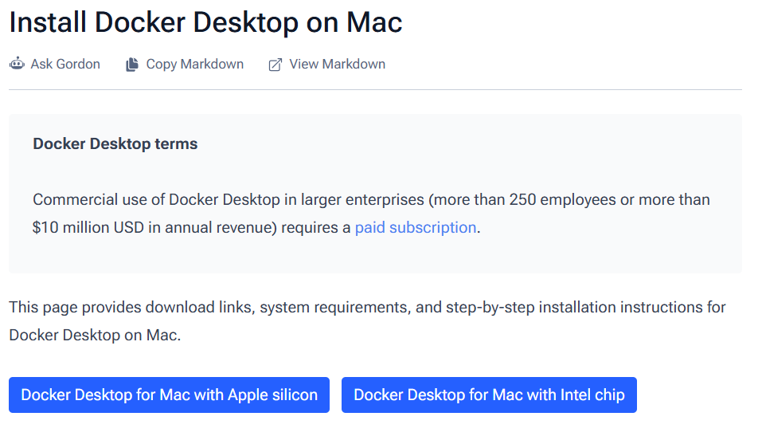

# 10주차 세미나 사전과제 안내

세미나 전까지 아래 준비와 실행 확인을 완료해주세요. 설치 중 재부팅이 필요할 수 있으니 미리 준비 부탁드립니다!

이번 세미나에서는 작은 FastAPI 앱을 Docker 컨테이너로 실행하고, GitHub Actions로 테스트와 이미지 빌드를 자동화해볼 예정입니다. 

진행 순서: **준비물 확인 → 세미나 레포 Fork·클론 → Docker 설치·검증 → 패키지 설치·테스트 → API 실행 확인**

## 1. 준비할 것

| 준비물 | 용도 | 완료 기준 |
| --- | --- | --- |
| Docker Desktop | 컨테이너 실행, Compose | `hello-world` 실행 성공 |
| 기존에 설치한 Python 3.10 이상 | 로컬 API 실행과 테스트 | 가상환경 생성·테스트 성공 |
| Git | 코드 업로드 | `git --version` 성공 |
| GitHub 계정 | GitHub Actions 사용 | 웹 로그인 가능 |
| VS Code | 파일 작성  | 프로젝트 폴더 열기 가능 |

이번 세미나에서는 인텔리제이 대신 VS Code를 사용할 예정입니다.

Python은 Django 세미나에서 설치했던 것을 그대로 사용합니다. 별도로 재설치할 필요는 없습니다. 

## 2. 세미나 레포 Fork하고 클론하기

실습 코드는 이미 준비되어 있으니 코드를 입력할 필요 없이 git clone만 해주시면 됩니다. 

### ① 본인 계정으로 Fork

[세미나 저장소](https://github.com/bluebomin/docker-cicd-seminar)

저장소 오른쪽 위 **Fork → Create fork**를 눌러 본인 GitHub 계정으로 복사해주세요. 

### ② Git 설치 확인

Windows는 PowerShell, Mac은 터미널에서 실행합니다.

```bash
git --version
```

Git 버전이 출력되면 다음으로 진행합니다. 

### ③ 본인의 Fork 저장소 클론

개인 PC의 `Documents/GitHub` 등 작업용 폴더에서 터미널을 엽니다. 
**기존 Likelion 레포 내부가 아닌 별도의 작업 폴더**를 사용해 주셔야 합니다! 

Fork한 저장소의 **Code → HTTPS**에서 주소를 복사해 줍니다. 아래의 `YOUR_USERNAME`은 본인 GitHub 아이디로 바꿔주세요.

```bash
git clone https://github.com/YOUR_USERNAME/docker-cicd-seminar.git
cd docker-cicd-seminar
git remote -v
```

`origin`이 **본인 GitHub 계정의 저장소**를 가리켜야 합니다!!
제 계정인 `bluebomin`을 넣어서 그대로 클론한 경우 본인 계정의 Fork를 다시 클론해 주세요.

### ④ VS Code로 열기

VS Code에서 **File → Open Folder**를 선택해 클론한 `docker-cicd-seminar` 폴더를 엽니다. **Terminal → New Terminal**로 실습 터미널을 열어주세요.

```text
Documents/GitHub/
├── 기존-동아리-레포/
└── docker-cicd-seminar/
    ├── README.md
    ├── main.py
    ├── requirements.txt
    ├── test_main.py
    ├── .gitignore
    └── .dockerignore
```

이후 프로젝트 관련 명령은 모두 **클론한 `docker-cicd-seminar` 폴더 안에서** 실행해줄 거에요.
Dockerfile과 Actions 설정은 세미나 진행하며 작성해볼 예정입니다! 

## 3. Docker Desktop 설치

### Windows

1. [Docker 공식 Windows 설치 안내](https://docs.docker.com/desktop/setup/install/windows-install/)를 열어 PC에 맞는 설치 파일을 받아줍니다. 
2. 안내의 지원 OS와 시스템 요구사항을 확인합니다.
3. WSL2를 사용하는 방식으로 설치합니다. 

```powershell
wsl --version
```

WSL이 설치되어 있지 않은 경우 관리자 PowerShell에서 실행:

```powershell
wsl --install
```

이미 설치되어 있지만 업데이트가 필요한 경우 관리자 PowerShell에서 실행:

```powershell
wsl --update
```

재부팅 안내가 나오면 재부팅을 해주어야 합니다. 

Docker Desktop을 직접 열어 초기 설정을 완료하고 Engine이 실행될 때까지 기다립니다.

WSL 설치가 실패하거나 가상화 관련 오류가 나오면 메시지를 저에게 알려주세요. PC의 가상화 설정을 추가로 확인해야 할 수 있습니다.

### macOS

아래 사진에서 본인 Mac에 맞는 버튼을 눌러 **Docker.dmg**를 다운로드해주세요. 터미널에서 설치 명령을 입력할 필요는 없습니다.



- **M1/M2/M3 등 Apple 칩**: [Apple Silicon용 Docker.dmg 다운로드](https://desktop.docker.com/mac/main/arm64/Docker.dmg)
- **Intel 프로세서**: [Intel용 Docker.dmg 다운로드](https://desktop.docker.com/mac/main/amd64/Docker.dmg)

칩을 모르겠다면 Apple 메뉴 → **이 Mac에 관하여**에서 확인해주세요.

1. 다운로드한 **Docker.dmg** 파일을 더블클릭합니다.
2. 열린 창에서 **Docker 아이콘을 Applications 폴더로 드래그**합니다.
3. Applications에서 **Docker 앱을 실행**하고 약관에 동의한 뒤 초기 안내를 완료합니다.
4. Docker가 실행되면 아래 **Docker 설치 확인** 단계로 진행합니다.

[Docker 공식 Mac 설치 안내](https://docs.docker.com/desktop/setup/install/mac-install/)

Docker Desktop에는 Docker Compose가 포함되어 있어 별도 Compose 설치가 필요하지 않습니다. [공식 Compose 설치 안내](https://docs.docker.com/compose/install/)

### Linux를 사용하는 경우

[Docker Engine 설치 안내](https://docs.docker.com/engine/install/)와 [Compose 플러그인 설치 안내](https://docs.docker.com/compose/install/linux/)를 따라 준비합니다. 아래 검증 명령이 정상 실행되는 상태로 준비해주세요. 권한 오류가 나면 세미나 전에 미리 알려주세요.

## 4. Docker 설치 확인

**Docker Desktop을 켠 상태에서** Windows는 PowerShell, Mac은 터미널을 열고 아래 명령을 하나씩 실행합니다.

```bash
docker --version
docker version
docker info
docker compose version
docker run --rm hello-world
```

| 명령 | 성공 기준 |
| --- | --- |
| `docker --version` | Docker 버전 출력 |
| `docker version` | Client와 Server 정보가 모두 출력 |
| `docker info` | 서버 정보 출력, daemon 연결 오류 없음 |
| `docker compose version` | Docker Compose v2 계열 버전 출력 |
| `docker run --rm hello-world` | `Hello from Docker!` 출력 |

첫 실행은 이미지를 다운로드하므로 인터넷이 연결된 상태에서 실행해 주어야 합니다. `hello-world` 컨테이너는 메시지를 출력한 뒤 종료하는 것이 정상입니다!

### 브라우저 접속까지 확인하기

`hello-world` 성공 후, 포트 연결도 확인합니다.

```bash
docker run --rm -d --name seminar-docker-check -p 18080:80 nginx:alpine
```

브라우저에서 **http://localhost:18080**을 열어 `Welcome to nginx!`가 보이는지 확인합니다.

```bash
docker ps
docker logs seminar-docker-check
docker stop seminar-docker-check
```

`docker ps`에서 컨테이너를 확인하고, 확인이 끝나면 `stop`으로 정리합니다. `--rm` 옵션으로 종료된 검증용 컨테이너가 자동 삭제됩니다.

18080번 포트를 이미 쓰고 있다면 `-p 18081:80`으로 바꾸고 http://localhost:18081 에 접속합니다.

## 5. 가상환경 만들고 패키지 설치

아래 명령은 **클론한 docker-cicd-seminar 폴더 안에서** 실행합니다. 가상환경 활성화 없이 해당 Python을 직접 사용하므로 PowerShell의 스크립트 실행 정책을 바꿀 필요가 없습니다.

### Windows PowerShell

```powershell
python --version
python -m venv .venv
.\.venv\Scripts\python.exe -m pip install --upgrade pip
.\.venv\Scripts\python.exe -m pip install -r requirements.txt
.\.venv\Scripts\python.exe -m pip check
.\.venv\Scripts\python.exe -m pytest -q
```

### macOS/Linux

```bash
python3 --version
python3 -m venv .venv
./.venv/bin/python -m pip install --upgrade pip
./.venv/bin/python -m pip install -r requirements.txt
./.venv/bin/python -m pip check
./.venv/bin/python -m pytest -q
```

기존 Python 버전을 확인한 뒤 가상환경을 만듭니다. Python 3.10 이상을 사용해주세요. Windows에서 `python` 명령을 찾지 못하지만 `py`가 동작한다면 `py --version`, `py -m venv .venv`를 사용하면 됩니다.

성공 기준:

- `pip check`: `No broken requirements found.`
- `pytest`: `1 passed` 포함

## 6. FastAPI 로컬 실행 확인

Windows PowerShell:

```powershell
.\.venv\Scripts\python.exe -m uvicorn main:app --reload --host 127.0.0.1 --port 8000
```

macOS/Linux:

```bash
./.venv/bin/python -m uvicorn main:app --reload --host 127.0.0.1 --port 8000
```

실행 중인 터미널을 그대로 두고 브라우저에서 확인합니다.

- http://localhost:8000 → `{"message":"hello docker"}` 응답
- http://localhost:8000/docs → Swagger UI 화면

`/docs`에서 GET `/` → Try it out → Execute를 눌러 200 응답을 확인합니다.

확인 후 터미널에서 **Ctrl+C**를 눌러 서버를 종료해주세요. 세미나에서 Docker 컨테이너가 같은 8000번 포트를 사용합니다.

## 7. 최종 체크리스트

- [ ]  Docker Desktop 실행 완료
- [ ]  `docker version`에 Client·Server 정보 출력
- [ ]  `docker info` 성공
- [ ]  `docker compose version` 성공
- [ ]  `docker run --rm hello-world`에서 `Hello from Docker!` 확인
- [ ]  검증용 nginx 화면 접속 후 컨테이너 종료
- [ ]  기존 Python 3.10 이상 및 Git 명령 실행 확인
- [ ]  클론한 프로젝트에서 가상환경 생성·패키지 설치 완료
- [ ]  `pip check` 성공, `pytest`에서 `1 passed` 확인
- [ ]  API 응답과 `/docs` 확인 후 Ctrl+C로 종료
- [ ]  본인 계정으로 Fork·클론 완료, origin 주소 확인

## 8. 문제가 생겼을 때 참고

| 증상 | 확인할 것 |
| --- | --- |
| `docker` 명령을 찾을 수 없음 | 설치 완료 여부 확인 후 터미널 다시 열기 |
| `Cannot connect to the Docker daemon` 또는 연결 오류 | Docker Desktop 실행, Engine 시작 완료 여부 확인 |
| Windows WSL·가상화 관련 오류 | `wsl --version` 확인, 설치·업데이트 후 재부팅, 오류 메시지 전달 |
| `hello-world` 다운로드 실패 | 인터넷·프록시 상태 확인, 재시도 후 오류 전달 |
| 컨테이너 이름이 이미 사용 중 | `docker ps -a`로 확인. 본인이 만든 검증 컨테이너가 실행 중이면 `docker stop seminar-docker-check`, 종료 상태면 `docker rm seminar-docker-check` |
| `port is already allocated` | 해당 서버 종료 또는 호스트 포트 변경 |
| Python 명령을 찾을 수 없음 | 설치와 PATH 확인, 터미널 다시 열기 |
| `requirements.txt` 또는 `main`을 찾지 못함 | 현재 위치가 프로젝트 폴더인지 확인. Windows는 `Get-Location`, Mac은 `pwd` |
| `ModuleNotFoundError` | 위 가상환경 Python으로 패키지 설치·실행했는지 확인 |
| 브라우저 접속 실패 | 서버 터미널의 오류 확인, 실행 중인지 확인, 주소와 포트 확인 |

## 최종 확인

Docker Desktop을 켜고 아래 명령을 실행해 보면 됩니다. 

```bash
docker version
docker compose version
docker run --rm hello-world
```
오류가 발생하면 **본인의 운영체제(window인지, mac인지)와 실행한 명령, 오류 메시지**를 저에게 알려주세요. 설치 검증이 끝나지 않은 상태로 당일에 오지 않도록 미리 확인 부탁드립니다!
